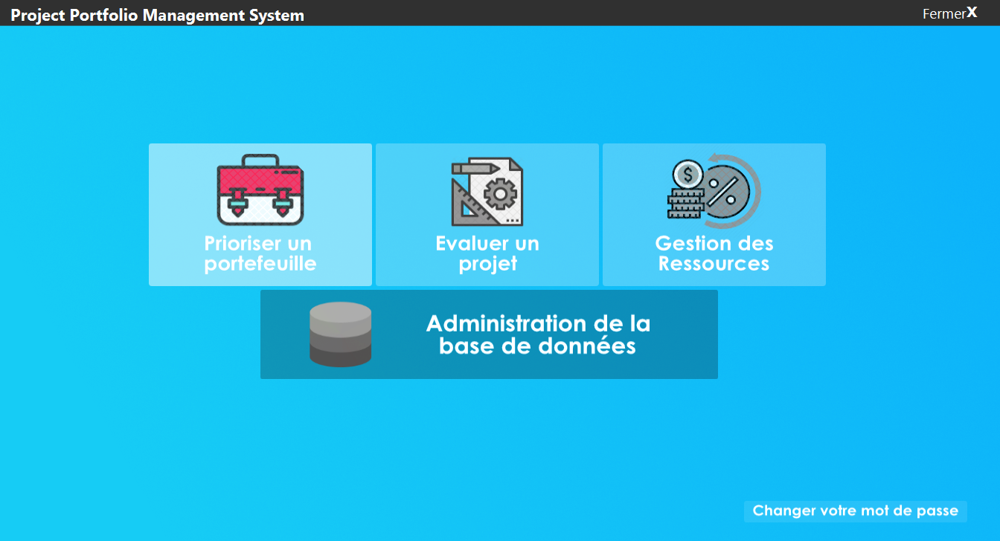
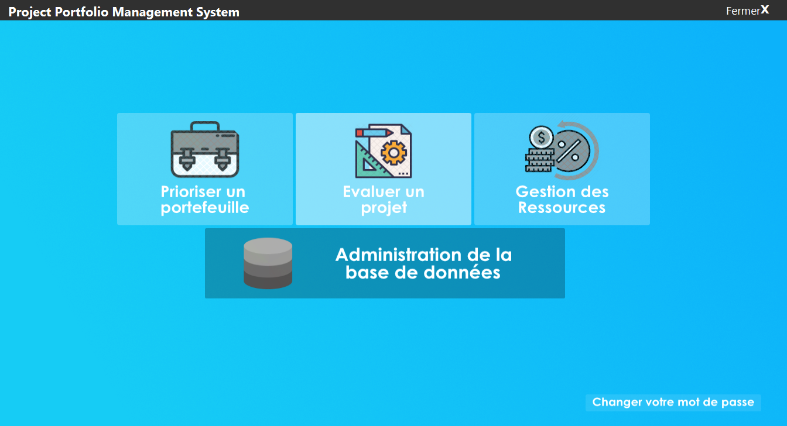
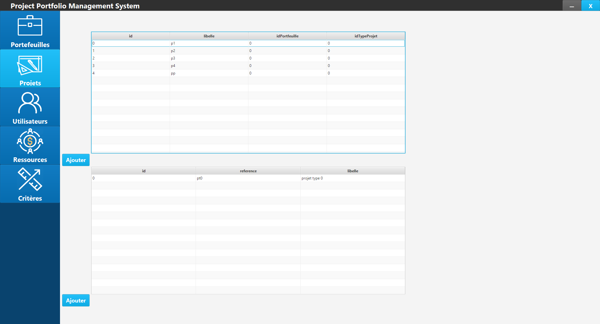
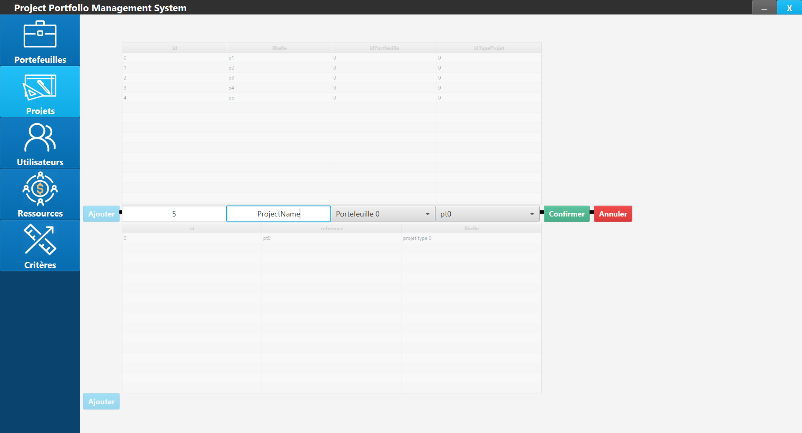
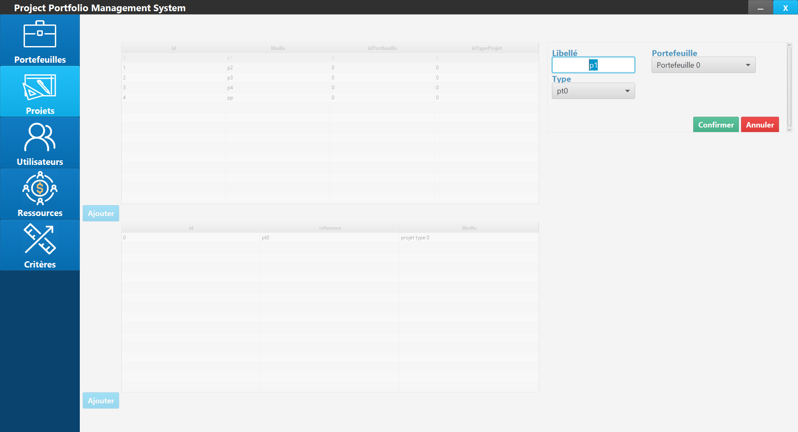
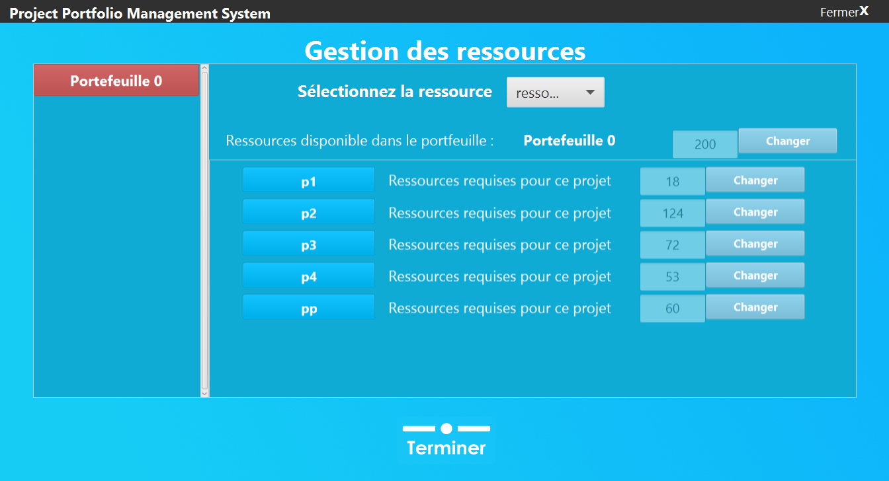
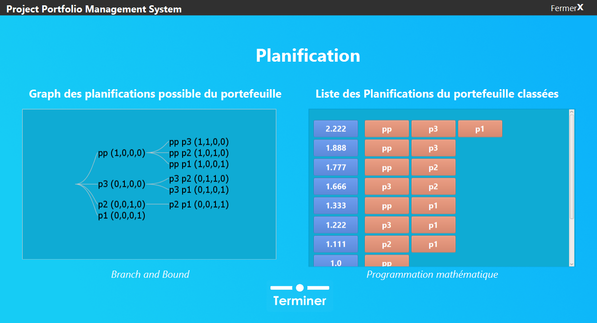

# Project Portfolio Management System
This is a software that demonstrates a digitized way to manage projects inside an enterprise by weighting in the different aspects of each project, and under the restrictions of available resources, the system recommends the most optimized set of projects.

This project was built as a proof of concept in collaboration with a PhD candidate to demonstrate a real world application of his theoretical findings.
The link to the thesis can be found [here](https://www.researchgate.net/publication/334682621_Analysis_and_Design_of_a_Project_Portfolio_Management_System).

# Screenshots of the System

## Main Interface :

## Data Creation Interface

## Data management and assessement example

## Visualtion of the result of calculations 
